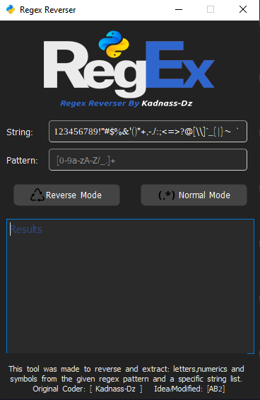

# Regex-Reverser

This tool helps you to reverse any regex and gives you the opposite/allowed: letters,numerics and symbols.

## Screenshots




## Usage

```python
python3 run.py
```


## Requirements

```bash
pip install PyQt5
```
    
## Authors

- Original Coder [@Kadnass-Dz](https://www.github.com/kadnass-dz)

- Idea/Modified [@ab2pentest](https://github.com/ab2pentest)
