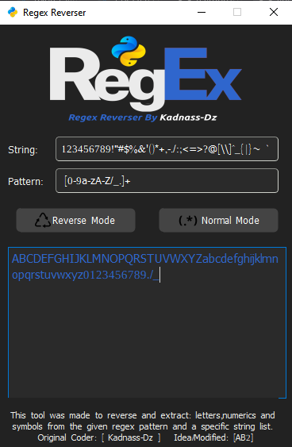

# Regex Reverser

1) This is a GUI python3 tool.

2) This tool helps you to reverse any regex and gives you the opposite/allowed: letters,numerics and symbols.

3) You may find it helpful in CTFs :wink:.

## Example/Screenshot

Regex Pattern: `[0-9a-zA-Z/_.]+`

In `Reverse Mode`:


In `Normal Mode`:



## Usage

```python
python3 run.py
```


## Requirements

```bash
pip install PyQt5
```
    
## Authors

- Original Coder [Kadnass-Dz](https://www.github.com/kadnass-dz)

- Idea/Modified [AB2](https://github.com/ab2pentest)
